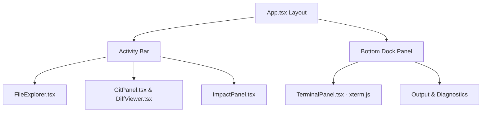

# Atlas Studio Development Log — Chapter 6: Professional IDE Core v0.1

This chapter documents the design and implementation of the core developer features for **Atlas Studio v0.1**: Integrated Terminal, File Explorer Tree View, and Git Source Control Panel.

---

## 1. Product Philosophy: IDE First, AI Second

As defined in the product focus specification:
> *"If AI is disabled, Atlas Studio must still be an excellent, fully-functional IDE."*

Atlas Studio is designed as a standalone, installable desktop IDE. The editor shell owns the core developer platform (terminal, file tree, source control, split editor, tabs), and AI/Memory/Impact tools attach to the platform as modular plugins.

---

## 2. Component Architecture & IPC Handlers

We implemented comprehensive Electron IPC bridges and React renderer components:

### A. Integrated Terminal (`TerminalPanel.tsx`)
- Embeds `@xterm/xterm` with `@xterm/addon-fit` inside the bottom dock panel.
- Spawns background shell processes (PowerShell / bash) via `child_process.spawn`.
- Streams stdin/stdout in real-time over Electron IPC (`atlas:terminal-input`, `atlas:terminal-data`).

### B. File Explorer (`FileExplorer.tsx`)
- Hierarchical workspace tree view rendering files and folders recursively.
- Supports file creation, directory expansion, file deletion, and opening files into tabs.
- Supports workspace folder selection (`dialog.showOpenDialog`).

### C. Git Source Control Panel (`GitPanel.tsx` & `DiffViewer.tsx`)
- Executes `git status --porcelain` to categorise changes into Staged and Working Tree.
- One-click Stage / Unstage controls (`git add` / `git restore --staged`).
- Commit message entry box + `git commit -m` integration.
- `DiffViewer.tsx`: Line-by-line diff inspector with syntax highlighting for added (`+`) and deleted (`-`) lines.

---

## 3. Verification & Build Output

- All 6 workspace packages compile with zero TypeScript errors (`turbo run build`).
- Monorepo test suites pass 100% cleanly (`pnpm test`).
- Standalone installer pipeline packages Atlas Studio into a single installable setup file:
  `apps/editor/dist-app/AtlasStudio Setup 0.1.0.exe`.
