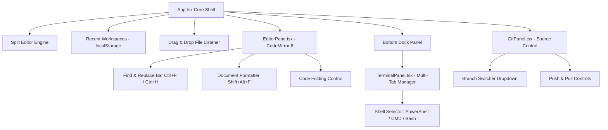

# Atlas Studio Architecture RFC-008: Core Editor Polish & Developer Workflow

This RFC documents the implementation of **Milestone 1 (Core Editor Polish)** and **Milestone 2 (Developer Workflow)** from the Chapter 7 Development Roadmap (Phase 2).

---

## 1. Overview & Architecture Goals

Atlas Studio prioritizes a developer-first standalone editor shell that functions without any AI dependencies. The core editor and workspace workflow were enhanced to provide parity with industry-standard IDEs.

---

## 2. Technical Implementation

### A. Editor Polish (`EditorPane.tsx`)
- **Find & Replace Panel (`Ctrl+F` / `Ctrl+H`)**:
  - Embedded floating control box with match inputs, previous match, next match, replace, and replace all triggers.
- **Document Formatting (`Shift+Alt+F`)**:
  - Auto-indents and cleans whitespace across active files.
- **Code Folding**:
  - Integrated `foldAll` and `unfoldAll` CodeMirror 6 commands.

### B. Workspace & Split View (`App.tsx`)
- **Split Editor Mode (`Ctrl+\`)**:
  - Side-by-side dual editor panes allowing concurrent code reference.
- **Recent Workspaces**:
  - Persists up to 10 recently accessed workspace folders in `localStorage` (`atlas_recent_projects`).
  - Displays clickable recent project cards on the Welcome Screen.
- **Drag & Drop Workspace**:
  - Listens for file drop events on the application window to open files.

### C. Multi-Tab Terminal & Shell Selector (`TerminalPanel.tsx`)
- **Multi-Tab Terminal Manager**:
  - Spawns and manages independent xterm.js terminals per tab (`Terminal 1`, `Terminal 2`).
- **Shell Selector**:
  - Dropdown interface for choosing execution shell (`PowerShell`, `Command Prompt`, `Git Bash`).

### D. Git Branching & Remote Sync (`GitPanel.tsx`)
- **Branch Switcher**:
  - Live branch selector dropdown (`git branch --list` / `git checkout`).
- **Push & Pull Actions**:
  - Action buttons triggering `git pull` and `git push` routines with visual sync status banners.

---

## 3. Verification & Build Confirmation

- **TypeScript Compilation**: `pnpm --filter @atlas/editor build` passed cleanly with 0 errors.
- **Runtime Verification**: App launched successfully via `dist-app/win-unpacked/AtlasStudio.exe`.
