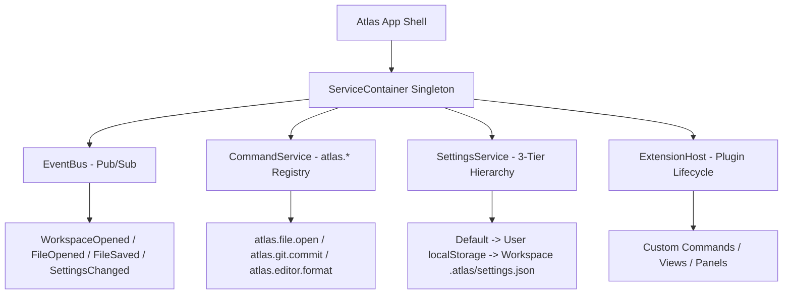

# Atlas Studio Architecture RFC-009: Platform Foundation & Service Container

This RFC documents the design and implementation of **Chapter 8 (Phase 3): Platform Foundation** for Atlas Studio, introducing a Service-Oriented Architecture (SOA), Central Dependency Injection (`ServiceContainer`), Typed Event Bus (`EventBus`), Unified Command Infrastructure (`CommandService`), Hierarchical Settings Engine (`SettingsService`), and isolated Extension Host (`ExtensionHost`).

---

## 1. Architectural Principles

1. **Service Decoupling**: Features communicate through explicit service interfaces rather than direct component cross-imports.
2. **Command Centralization**: All actions (`atlas.*`) execute via a unified command engine used by the Command Palette, menus, keyboard shortcuts, and extensions.
3. **Event-Driven Communication**: A typed pub/sub event bus replaces hardcoded module calls.
4. **Hierarchical Configuration**: 3-tier settings engine (**Default** -> **User** -> **Workspace**).

---

## 2. Implementation Specifications

### A. Typed Event Bus (`packages/core/src/events/EventBus.ts`)
Handles core lifecycle events:
- `WorkspaceOpened`
- `FileOpened`
- `FileSaved`
- `ActiveEditorChanged`
- `GitStatusChanged`
- `TerminalCreated`
- `ThemeChanged`
- `SettingsChanged`
- `CommandExecuted`

### B. Command Infrastructure (`packages/core/src/services/CommandService.ts`)
- Manages command registration and execution by ID.
- Automatically emits `CommandExecuted` events over `EventBus`.

### C. 3-Tier Settings Engine (`packages/core/src/services/SettingsService.ts`)
- Merges default settings, user settings (renderer `localStorage`), and workspace settings (`.atlas/settings.json`).

### D. Isolated Extension Host (`packages/core/src/services/ExtensionHost.ts`)
- Provides `activate(context)` and `deactivate()` lifecycle hooks.
- Offers scoped registration methods (`registerCommand`, `registerView`, `registerPanel`).

### E. Service Container (`packages/core/src/platform/ServiceContainer.ts`)
- Central Dependency Injection singleton hosting platform services.

---

## 3. Test & Build Verification

- **Unit Test Suite**: Created `packages/core/tests/platform.test.ts` verifying pub/sub events, command registration, settings hierarchy, extension activation, and DI container resolution.
- **Monorepo Tests**: All 7 turbo test suites passed 100%.
- **Editor App**: `pnpm --filter @atlas/editor build` compiled cleanly.
