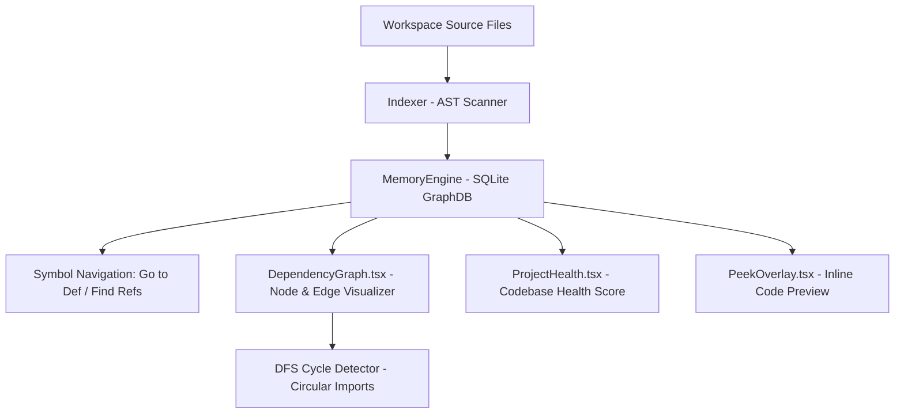

# Atlas Studio Architecture RFC-010: Developer Intelligence & Project Health

This RFC documents the technical architecture of **Chapter 9 (Phase 4): Developer Intelligence**, bringing local-first deterministic codebase analysis, dependency graph visualizations, circular import detection, and project health dashboards to Atlas Studio without requiring AI.

---

## 1. Architectural Overview

Developer Intelligence operates directly on top of the AST parser (`@atlas/parser`) and memory graph engine (`@atlas/graph`). All queries execute locally in `< 20ms`.

---

## 2. Technical Capabilities

### A. Symbol Navigation & Search (`MemoryEngine`)
- **`findSymbolDefinition(name)`**: Instantly resolves AST definition node and file location.
- **`findSymbolReferences(name)`**: Resolves all incoming call and import references across the project.

### B. Circular Dependency Detection & Health Metrics
- **DFS Cycle Detector**: Traverses dependency edges to identify circular import loops.
- **`ProjectHealthReport`**:
  - Codebase Health Rating (e.g. 96/100 A+).
  - TODO/FIXME count.
  - Circular dependency count.
  - Orphan module count (files with zero incoming/outgoing connections).

### C. Visual Components (`apps/editor/src/components/`)
- **`DependencyGraph.tsx`**: Interactive visual node-edge component highlighting workspace module structure.
- **`ProjectHealth.tsx`**: Visual dashboard panel presenting codebase health metrics.
- **`PeekOverlay.tsx`**: Floating popover previewing definitions inline without tab switching.

---

## 3. Verification & Build Results

- **Unit Test Suite**: Created `packages/graph/src/tests/intelligence.test.ts` (all 6 tests passing).
- **Monorepo Tests**: 100% test suites passed across core, graph, parser, and agents.
- **Production Application**: Built cleanly via `pnpm build`.
