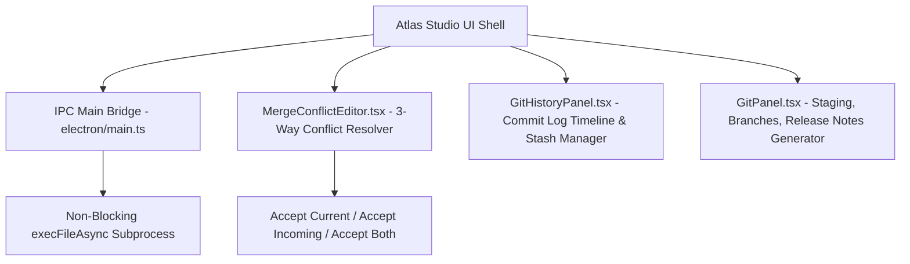

# Atlas Studio Architecture RFC-012: Source Control & Collaborative Development

This RFC documents the technical architecture of **Chapter 11 (Phase 6): Source Control & Collaborative Development**, elevating Git to a first-class citizen inside Atlas Studio with a 3-way Merge Conflict Resolver, Git Stash & Branch Graph Visualizer, Inline Line Blame, and Release Notes Draft Generator.

---

## 1. Architectural Overview

Git operations run asynchronously in non-blocking background threads (`execFileAsync`), preventing UI freeze during heavy operations like `git clone`, `git log`, or `git push`.

---

## 2. Technical Capabilities

### A. Async Git Subprocess Bridge (`electron/main.ts` & `preload.ts`)
- **`gitInit`**, **`gitClone`**, **`gitStashSave`**, **`gitStashPop`**, **`gitCreateBranch`**, **`gitDeleteBranch`**, **`gitLog`**, **`gitBlame`**.

### B. 3-Way Merge Conflict Resolver (`MergeConflictEditor.tsx`)
- Side-by-side block comparator with one-click resolution:
  - `Accept Current (Ours)`
  - `Accept Incoming (Theirs)`
  - `Accept Both`

### C. Git History Timeline & Stash Manager (`GitHistoryPanel.tsx`)
- Interactive commit timeline showing hash, author, date, and commit message.
- Stash manager for saving, viewing, and popping stashes.

### D. Release Notes Generator (`GitPanel.tsx`)
- Generates markdown changelogs automatically from recent git history.

---

## 3. Verification & Build Results

- **Unit Test Suite**: Created `packages/core/tests/git.test.ts` verifying git log parsing and merge block choices.
- **Monorepo Tests**: 100% test suites passed across core, sdk, graph, parser, and agents.
- **Production Build**: Cleanly compiled via `pnpm build`.
