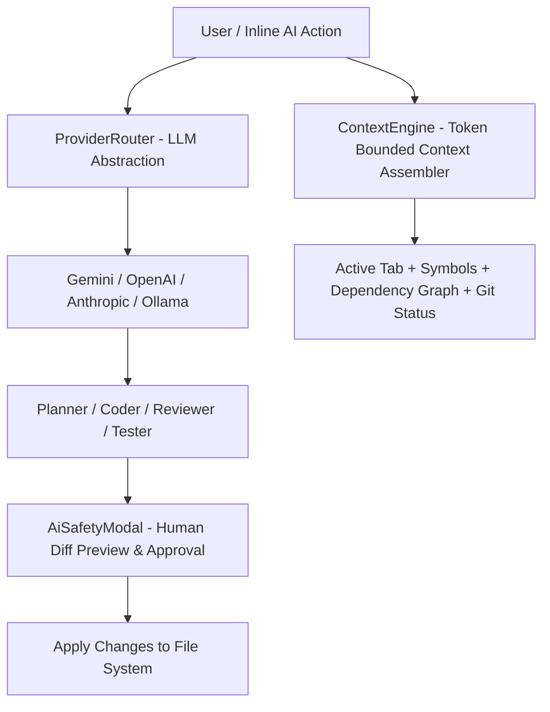

# Atlas Studio Architecture RFC-013: AI Runtime & Agent Architecture

This RFC documents the technical architecture of **Chapter 12 (Phase 7): AI Runtime & Agent Architecture**, delivering a provider-agnostic, token-bounded AI runtime that operates as an unprivileged extension via `@atlas/sdk`, backed by human approval safety controls and inline developer assistant tools.

---

## 1. Core Architectural Principle

AI is non-privileged and optional. AI capabilities call standard public SDK platform APIs, require permission validation, and present proposed file changes in a colorized diff preview modal (`AiSafetyModal`) before mutating the workspace.

---

## 2. Technical Components

### A. Provider Router (`ProviderRouter.ts`)
- Configuration-driven model router:
  - **Google Gemini** (`gemini-2.0-flash`)
  - **OpenAI** (`gpt-4o`)
  - **Anthropic** (`claude-3-5-sonnet`)
  - **Ollama / Local LLM** (`http://localhost:11434/v1`)
  - Custom OpenAI-compatible endpoints.

### B. Token-Aware Context Engine (`ContextEngine.ts`)
- Dynamically gathers context from active editor, open tabs, AST dependency graph, git diff, and terminal logs while truncating context according to model token limits.

### C. Human Approval Safety Modal (`AiSafetyModal.tsx`)
- Popover modal displaying proposed code changes as colorized diffs (`+` / `-`) requiring developer confirmation before file mutation.

### D. Inline AI Assistant & Commands (`InlineAiTool.tsx`)
- `Explain Code` (`atlas.ai.explain`)
- `Generate Tests` (`atlas.ai.generateTests`)
- `Generate Documentation` (`atlas.ai.generateDocs`)

---

## 3. Verification & Build Results

- **Unit Test Suite**: Created `packages/agents/src/tests/runtime.test.ts` verifying ProviderRouter and ContextEngine context truncation.
- **Monorepo Tests**: 100% test suites passed across core, sdk, graph, parser, and agents.
- **Production Build**: Cleanly compiled via `pnpm build`.
