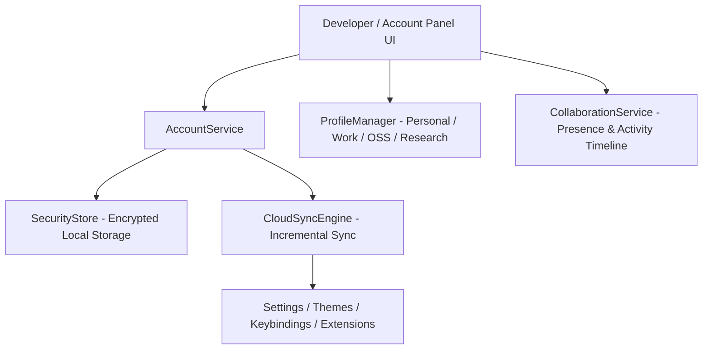

# Atlas Studio Architecture RFC-014: Cloud Sync, Accounts & Team Collaboration

This RFC documents the technical architecture of **Chapter 13 (Phase 8): Cloud Sync, Accounts & Team Collaboration**, bringing optional account authentication, multi-device environment synchronization, team activity timelines, and encrypted credential storage to Atlas Studio while preserving a 100% local-first, offline-ready core.

---

## 1. Core Architectural Principle

Cloud features extend Atlas beyond a single machine without ever replacing local execution. The core IDE does not require an active internet connection.

---

## 2. Technical Components

### A. Account Service & Local Encrypted Token Store (`AccountService.ts` & `SecurityStore.ts`)
- Manages sign-in, session state, device tokens, and offline detection.
- Stores credentials encrypted via `SecurityStore` in local storage.

### B. Cloud Sync Engine (`CloudSyncEngine.ts`)
- Selective, incremental synchronization for workspace settings, active themes, custom keybindings, and extension manifests.

### C. Workspace Profiles (`ProfileManager.ts`)
- Independent environment profiles:
  - **Personal** (Default personal projects)
  - **Work** (Enterprise team environment)
  - **Open Source** (Public open source profile)
  - **Research** (AI & ML sandbox)

### D. Team Collaboration & Activity Timeline (`CollaborationService.ts`)
- Real-time team member presence indicators and chronologically ordered team activity logs.

### E. Account & Collaboration UI (`AccountPanel.tsx`)
- Sidebar view (`Account` icon) rendering account status, profile switcher, cloud sync toggles, team presence, and activity timelines.

---

## 3. Verification & Build Results

- **Unit Test Suite**: Created `packages/core/tests/cloud.test.ts` testing AccountService, SecurityStore, ProfileManager, and CloudSyncEngine.
- **Monorepo Build**: Compiled all 7 monorepo packages cleanly (`pnpm build`).
- **Monorepo Tests**: 100% passed (`pnpm test`).
