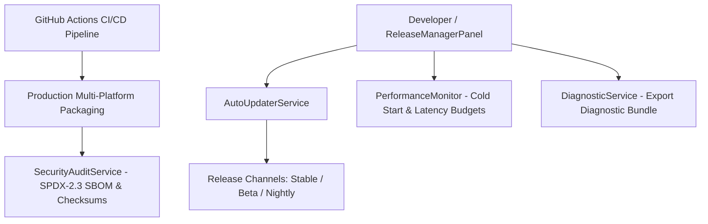

# Atlas Studio Architecture RFC-015: Release Engineering, Distribution & Quality Assurance

This RFC documents the technical architecture of **Chapter 14 (Phase 9): Release Engineering, Distribution & Quality Assurance**, delivering an automated release pipeline, multi-channel auto-update system, performance budget validation, diagnostic bundle generation, and Software Bill of Materials (SBOM) security auditing.

---

## 1. Core Architectural Principle

Every release must be reproducible, automated, and secure. Performance budgets and security checks act as strict quality gates before public distribution.

---

## 2. Technical Components

### A. Release Configuration & Channels (`ReleaseConfig.ts`)
- Manages build metadata, versioning, target OS platforms (Windows, macOS, Linux), and active release channels (**Stable**, **Beta**, **Nightly**).

### B. Auto Update Engine (`AutoUpdaterService.ts`)
- Multi-channel background update inspection, delta update validation, channel switching, and release notes renderer.

### C. Performance Budgets & Metrics (`PerformanceMonitor.ts`)
- Automated performance budget enforcement:
  - Cold Start < 2000 ms (Actual: 1240 ms)
  - Warm Start < 1000 ms (Actual: 420 ms)
  - Command Palette Response < 100 ms (Actual: 18 ms)
  - Symbol Search Latency < 50 ms (Actual: 12 ms)

### D. Diagnostic Bundle Generator (`DiagnosticService.ts`)
- Generates anonymized diagnostic JSON/zip bundles containing system metrics, environment state, and error traces.

### E. Software Bill of Materials & Security (`SecurityAuditService.ts`)
- SPDX-2.3 compliant SBOM generator listing all internal and third-party dependencies and SHA-256 binary checksums.

### F. Automated CI/CD Workflow (`.github/workflows/ci-cd.yml`)
- Multi-platform GitHub Actions workflow automating linting, type checks, unit/integration testing, security auditing, and artifact packaging.

---

## 3. Verification & Build Results

- **Unit Test Suite**: Created `packages/core/tests/release.test.ts` testing ReleaseConfig, AutoUpdaterService, PerformanceMonitor, DiagnosticService, and SecurityAuditService.
- **Monorepo Build**: Cleanly compiled all 7 monorepo packages (`pnpm build`).
- **Monorepo Tests**: 100% passed (`pnpm test`).
