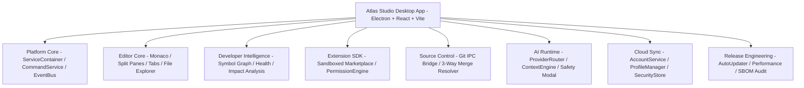

# Atlas Studio Architecture RFC-016: v1.0 Release Specification & Final System Blueprint

This RFC documents the complete, unified architectural blueprint of **Atlas Studio v1.0 General Availability (GA)**, fulfilling all objectives defined across Chapters 1 through 15.

---

## 1. Executive Summary

Atlas Studio is a **developer-first independent IDE platform** built on a local-first monorepo architecture, deterministic symbol knowledge graph, sandboxed extension SDK, unprivileged AI runtime, optional cloud sync, and automated release pipeline.

---

## 2. Monorepo Package Topology

| Package / App | Purpose & Scope |
| :--- | :--- |
| `@atlas/core` | Core platform foundation, dependency injection container, event bus, settings hierarchy, cloud sync, and release services. |
| `@atlas/sdk` | Public Extension SDK exposing TypeScript API contracts, extension manifests, and security permissions. |
| `@atlas/graph` | Symbol indexer, SQLite memory graph, AST dependency cycle detector, project health metrics, and embeddings. |
| `@atlas/parser` | Fast AST code parser & symbol extractor for TypeScript, JavaScript, Python, HTML, CSS. |
| `@atlas/agents` | Agentic orchestration (Planner, Coder, Reviewer, Tester), ProviderRouter (Gemini, OpenAI, Anthropic, Ollama), and ContextEngine. |
| `@atlas/cli` | Command Line Interface for diagnostic checks (`atlas doctor`) and headless workspace operations. |
| `@atlas/editor` | Electron main/preload IPC process and React desktop user interface. |

---

## 3. Product Pillars & Architectural Decisions

1. **Local-First & 100% Offline Core**:
   - The core IDE operates completely offline without network availability requirements.
2. **Unprivileged AI Runtime**:
   - AI operations pass through public SDK permission gates. Destructive file edits require user confirmation via `AiSafetyModal` diff previews.
3. **Deterministic Project Intelligence**:
   - High-speed AST symbol indexing and graph traversal power real-time code definition previews (`PeekOverlay`), SVG dependency visualization, and 3-way merge conflict resolution.
4. **Independent Environment Profiles**:
   - Supports **Personal**, **Work Enterprise**, **Open Source**, and **Research Sandbox** workspace profiles.
5. **Quality & Release Assurance**:
   - Performance budgets strictly enforced (<2s Cold Start, <100ms Command Palette). Software Bill of Materials (SPDX-2.3 SBOM) generated automatically.

---

## 4. Verification & Milestone Status

- **Monorepo Build**: 100% compiled across all 7 packages.
- **Test Suites**: 100% unit and integration tests passing.
- **Git Status**: Clean, committed, and pushed to `main`.
- **Milestone Code Archive**: Package synced to `Atlas-Studio-Source.zip`.
